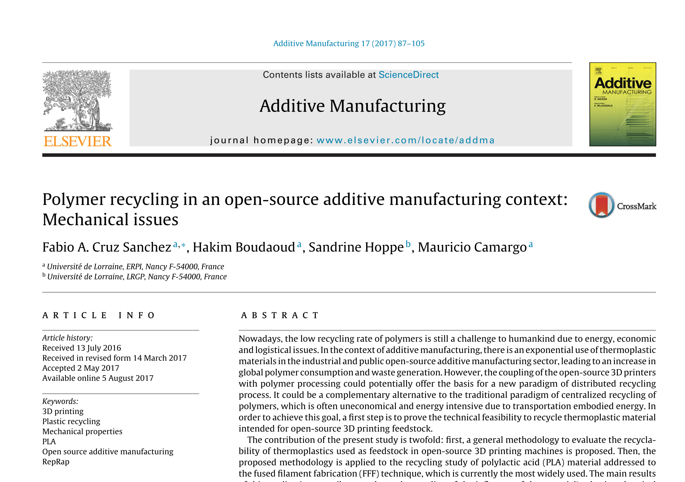
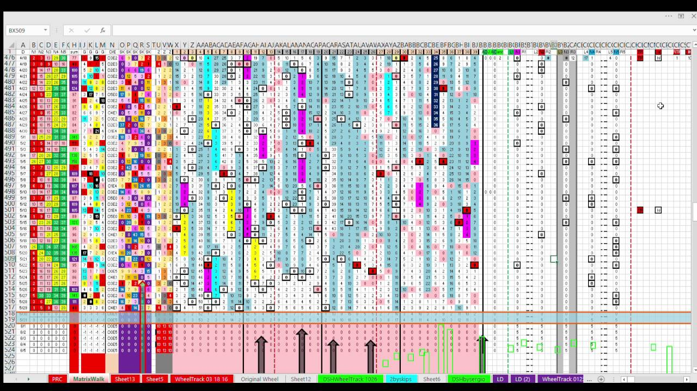
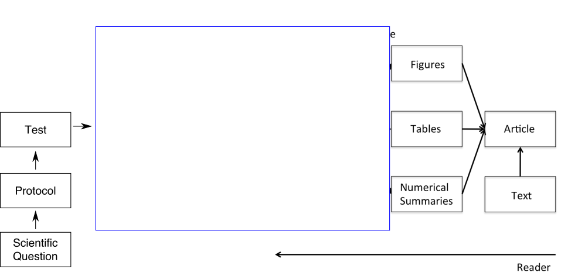
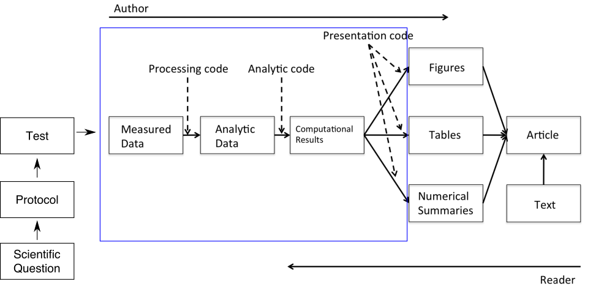
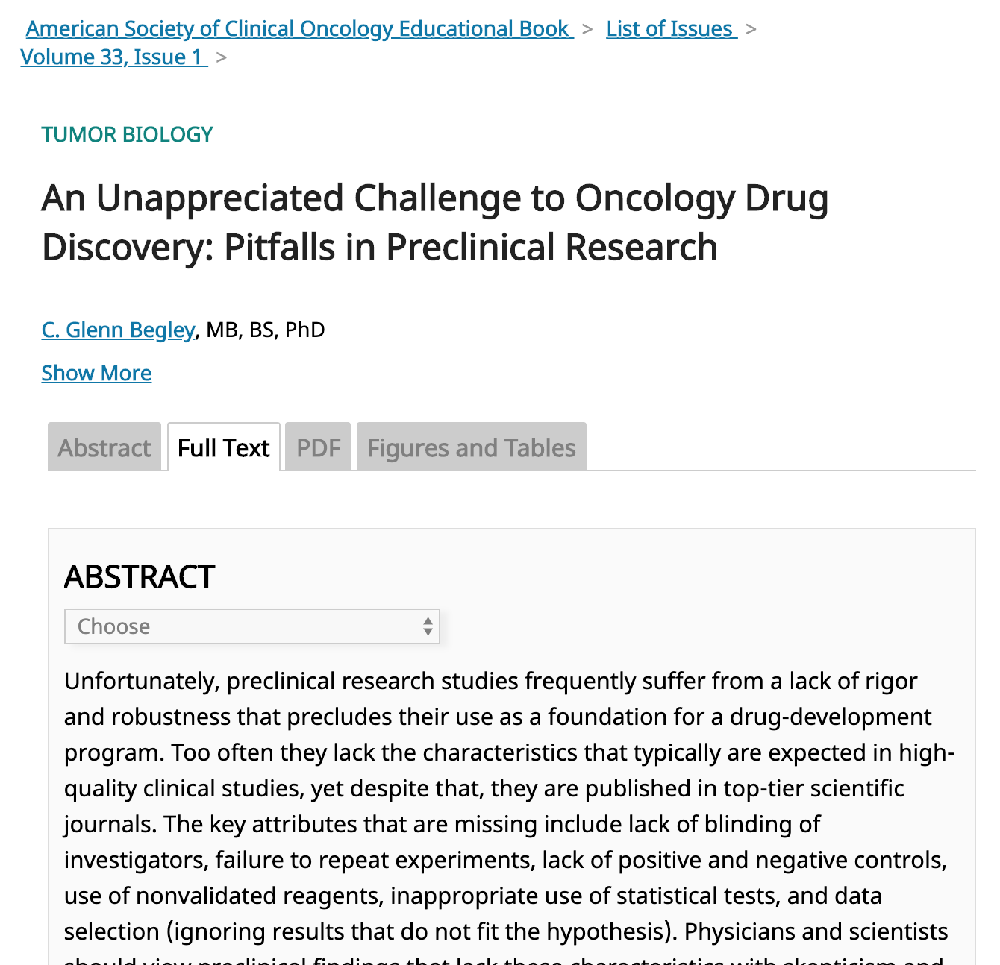
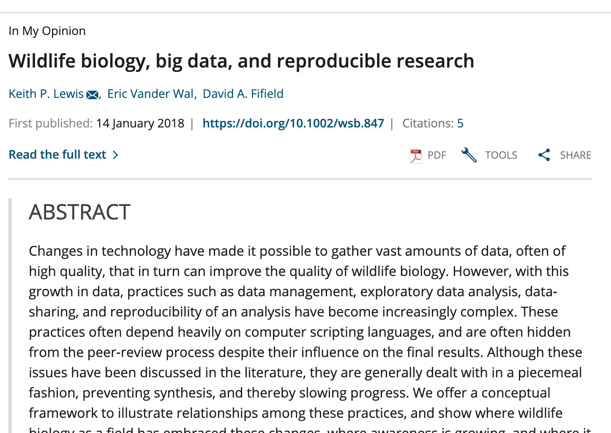
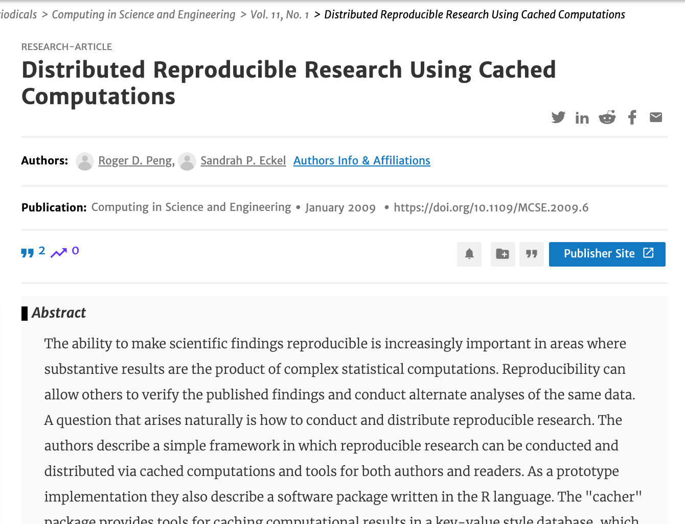
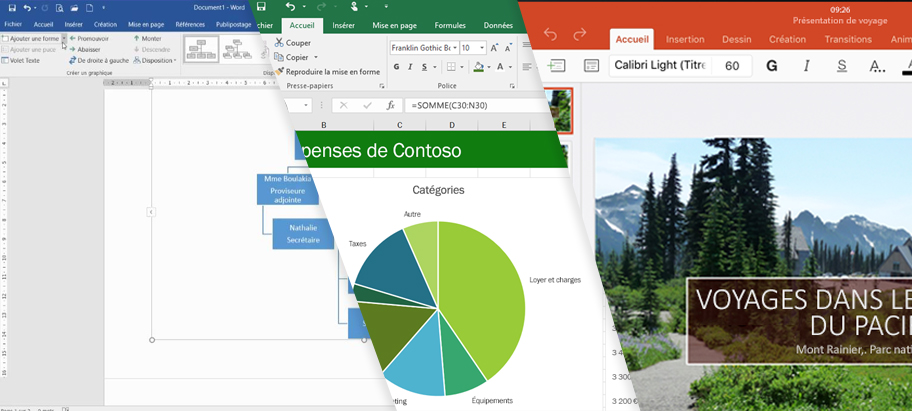

```{r packages, echo = FALSE, message=FALSE, warning=FALSE}
# Source
#source("xaringan-themer.R")

# load packages ----------------------------------------------------------------
library(tidyverse)
library(xaringanExtra)
library(xaringanthemer)
library(fontawesome)
library(here)
library(countdown)

options(htmltools.dir.version = FALSE)
knitr::opts_chunk$set(
  fig.path = 'assets/chunks/',  
  collapse = TRUE,
  fig.width=9, fig.height=3.5, fig.retina=3,
  out.width = "90%",
  fig.align = 'center',
  cache = FALSE,
  echo = FALSE,
  message = FALSE, 
  warning = FALSE,
  fig.show = TRUE,
  include = TRUE
)

# Link for the Figures
URL = c('https://raw.githubusercontent.com/fabbiocrux/Figures/main/')


# xaringanExtra
xaringanExtra::use_panelset()

#xaringanExtra::use_share_again()
xaringanExtra::use_tachyons()
xaringanExtra::use_tile_view()
xaringanExtra::use_webcam()
xaringanExtra::use_fit_screen()
xaringanExtra::use_extra_styles(hover_code_line = TRUE, mute_unhighlighted_code = TRUE)
xaringanExtra::use_share_again()
xaringanExtra::use_panelset()


```


# Learning goals

* Understand the process of create reproducible documents
* Have a first insight in the data visualization practices using datasets
* Experience the diversity of options that open practices offers to communicate your results. 


---

class: inverse middle center

# Motivation 1: Reproducibility


---

background-image: url("figures/2023-01-16-OpenScience.jpg")
background-position: 50% 50%
background-size: 100%
class: left bottom

---


## Music Vs. Research

.pull-left[
```{r, include=TRUE, fig.align='center', cache=TRUE, out.width='80%'}

```

]
.pull-right[
```{r, include=TRUE, fig.align='center', cache=TRUE, out.width='100%'}

```

]


---

## Music Vs. Research

.pull-left[
```{r, include=TRUE, fig.align='center', cache=TRUE, out.width='100%'}

```

]
.pull-right[
```{r, include=TRUE, fig.align='center', cache=TRUE, out.width='100%'}

```
]

---

## The paper pipeline

```{r Fig_open-science, }

```


---

## The document pipeline

```{r, include=TRUE, fig.align='center', cache=TRUE, out.width='90%'}

```


How to describe in detail this section for Research & Industry purposes

---

exclude: true

# Reproducibility and Replicability

.pull-left[
**Reproducibility**: 

Refers to the ability of a researcher to duplicate the results of a prior study using the same materials as were used by the original researcher (Goodman, Fanelli, and Ioannidis 2016).

- Focuses on the validity of the data analysis
- "Can we trust this analysis?"

]

.pull-rigth[
**Replicability:** 

This is the act of repeating an entire study, independently of the original investigator without the use of original data (but generally using the same methods).

- Important for policymakers and regulatory decisions

]


.footnote.small[
Goodman, Steven N., Daniele Fanelli, and John P. A. Ioannidis. 2016. “What Does Research Reproducibility Mean?” Science Translational Medicine 8 (341): 341ps12–341ps12. https://doi.org/10.1126/scitranslmed.aaf5027.
]

---


## Why do we need Reproducible Research?

- Avoid misconduct such as fraudulent data and plagiarism
- Data-intensive research (e.g Big data research)
- Distributed research






---

background-image: url("https://figures-na.ssl-figures-amazon.com/figures/I/41KSVC8Q2JL.jpg")
background-position: 90% 50%
background-size: 30%


## Reproducibility concepts

Two key elements: 

- .bg-yellow[**Literate programming for enabling reproducibilty**]
- Version control for enhancing transparency

*Literate programming refers to the use of a computing environment for authoring documents that contain a mix of natural (eg. English) and computer (eg. R) languages (Schulte et al. 2012)*


.pull-left[

]
.pull-right[
```{r, include=TRUE, fig.align='center', out.width='70%'}

```

]

.footnote[
D. E. Knuth, Literate Programming, The Computer Journal, Volume 27, Issue 2, 1984, Pages 97–111, https://doi.org/10.1093/comjnl/27.2.97
]


---

## Literate programming for Reproducibilty


```{r, include=TRUE, fig.align='center', cache=TRUE, out.width='70%'}
knitr::include_graphics("figures/rstudio.png")
```


---

class: middle inverse

#  Motivation 2: Data Visualization


---

## What is Data Visualization?

- Graphical representations of data

- Use different colors, shapes, and the coordinate system to summarize data

- Tell a story

- Useful for understanding


---

class: middle

## For example

- [How the BBC Visual and Data Journalism team works with graphics in R](https://medium.com/bbc-visual-and-data-journalism/how-the-bbc-visual-and-data-journalism-team-works-with-graphics-in-r-ed0b35693535)

-[Explore your activity on Spotify with R and “spotifyr”: How to analyze and visualize your streaming history and music tastes](https://towardsdatascience.com/explore-your-activity-on-spotify-with-r-and-spotifyr-how-to-analyze-and-visualize-your-stream-dee41cb63526)

-[Covid](https://statsandr.com/blog/how-to-create-a-simple-coronavirus-dashboard-specific-to-your-country-in-r/)
- [Open Data Science (In french)](https://github.com/frrrenchies/frrrenchies)


---

# Summary

- Reproducible research as a **minimum standard**, particularly for studies that are difficult to replicate

- Change of 
- Infrastructure is needed for creating and distributing reproducible documents, beyond what is currently available

- There is a growing number of tools for creating reproducible documents

## Some challengues

- It is not the solution for everyone.


---

class: middle


# Workflow in data science

```{r, echo=FALSE, out.width = '90%', fig.align="center"}
knitr::include_graphics("assets/img/data-science-workflow.png")
```

---

class: middle

# Workflow in data science, with **Tidyverse**

```{r, echo=FALSE, out.width = '80%', fig.align="center"}
knitr::include_graphics("assets/img/01_tidyverse_data_science.png")
```


---

class: middle

# Main goal of the workshop

 .Large[Zero to Hero for a reproducible document ]

.center[
##  https://rstudio.cloud/project/2139211
]


**Recommended setup**

1. Sign up for free version: https://rstudio.cloud/

2. Use you UL account!

3. Voila!, C'est bon


---

class: center, middle

# Thanks!

---

