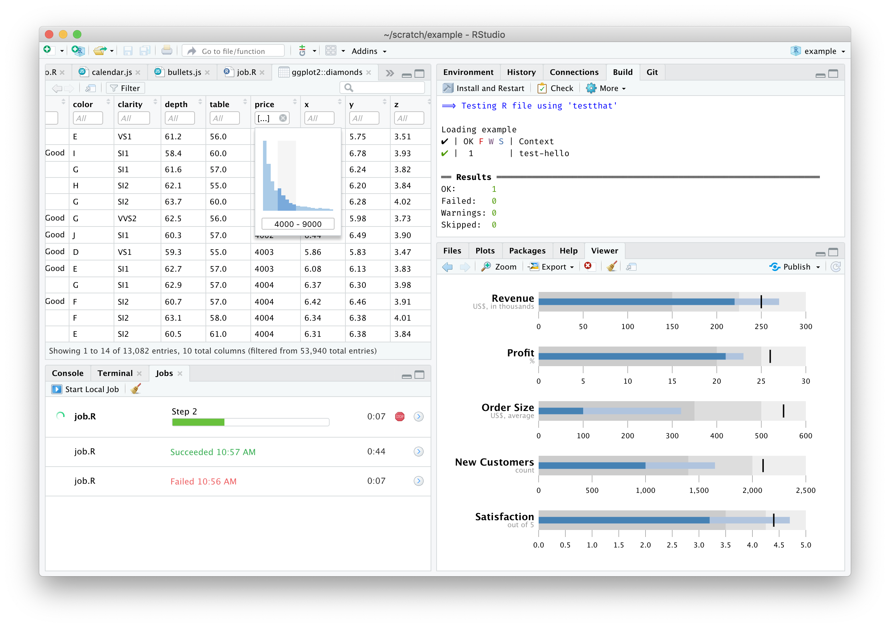

```{r packages, echo = FALSE, message=FALSE, warning=FALSE}
# Source
#source("xaringan-themer.R")

# load packages ----------------------------------------------------------------
library(tidyverse)
library(xaringanExtra)
library(xaringanthemer)
library(fontawesome)
library(here)


options(htmltools.dir.version = FALSE)
knitr::opts_chunk$set(fig.path = 'assets/chunks/', cache.path = "assets/cache/", 
  fig.width=9, fig.height=3.5, fig.retina=3,
  out.width = "100%",
  fig.align = 'center',
  cache = FALSE,
  echo = FALSE,
  message = FALSE, 
  warning = FALSE,
  fig.show = TRUE,
  hiline = TRUE,
  include = TRUE
)

# Link for the Figures
URL = c('https://raw.githubusercontent.com/fabbiocrux/Figures/main/')

#library(xaringanBuilder)
#build_pdf("index.Rmd")

# xaringanExtra
xaringanExtra::use_panelset()

#xaringanExtra::use_share_again()

library(fontawesome)
```

---

# Learning goals

* Understand the process of create reproducible documents
* Have a first insight in the data visualization practices using datasets
* Experience the diversity of options that open practices offers to communicate your results. 


---

## Assignments for ARCHE Plateform

After that, several questions need to be answered at the end of the tutorial. 

A pdf document with the results  are going to be upload to the ARCHE Platform to evaluate the comprehension of the module.


---

# Recommended setup 

1. Sign up for free version: https://rstudio.cloud/

2. Use you UL account!

3. Voila!, C'est bon


---

background-image: url("http://assets.aims.fao.org.s3-eu-west-1.amazonaws.com/public/figures/Open%20Science%20Monitor.jpg")
background-position: 95% 50%
background-size: 50%
class: left middle

.pull-left[
*"Open Science refers to ongoing changes <br>in the way research is conducted: 
for scientists themselves, through increasing the use of <br> 
open access scientific publishing and open data, <br>
and for the public, through increasing their understanding of and participation in science... <br>
Open Science is one of three priority areas for European research, science and innovation policy,"- [RAND Corporation](http://aims.fao.org/activity/blog/open-science-monitor-access-data-and-trends-open-science).*
]

---

# The paper pipeline

```{r Fig_open-science, }
knitr::include_graphics("figures/Article-pipeline-1.png")
```

---

## Music Vs. Research

.pull-left[
```{r, include=TRUE, fig.align='center', cache=TRUE, out.width='80%'}
knitr::include_graphics("figures/Musica.jpeg")
```

]
.pull-right[
```{r, include=TRUE, fig.align='center', cache=TRUE, out.width='100%'}
knitr::include_graphics("figures/Paper.png")
```

]


---

## Music Vs. Research

.pull-left[
```{r, include=TRUE, fig.align='center', cache=TRUE, out.width='100%'}
knitr::include_graphics("figures/excel-chaos.jpg")
```

]
.pull-right[
```{r, include=TRUE, fig.align='center', cache=TRUE, out.width='100%'}
knitr::include_graphics("figures/Paper.png")
```
]

---

# Main goal

- Understand the importance of the *replication principle* in research
- Create a first dynamic document using a *Literate programming approach*


---

# The document pipeline

```{r, include=TRUE, fig.align='center', cache=TRUE, out.width='90%'}
knitr::include_graphics("figures/Article-pipeline-2.png")
```


How to describe in detail this section for Research & Industry purposes

---

# Reproducibility and Replicability

**Reproducibility**: 

Refers to the ability of a researcher to duplicate the results of a prior study using the same materials as were used by the original researcher (Goodman, Fanelli, and Ioannidis 2016).

- Focuses on the validity of the data analysis
- "Can we trust this analysis?"

.footnote[

Goodman, Steven N., Daniele Fanelli, and John P. A. Ioannidis. 2016. “What Does Research Reproducibility Mean?” Science Translational Medicine 8 (341): 341ps12–341ps12. https://doi.org/10.1126/scitranslmed.aaf5027.

]
--

**Replicability:** 

This is the act of repeating an entire study, independently of the original investigator without the use of original data (but generally using the same methods).

- Important for policymakers and regulatory decisions


---


## Why do we need Reproducible Research?

- Avoid misconduct such as fraudulent data and plagiarism
- Data-intensive research (e.g Big data research)
- Distributed research


---
background-image: url("https://figures-na.ssl-figures-amazon.com/figures/I/41KSVC8Q2JL.jpg")
background-position: 90% 50%
background-size: 30%


## Reproducibility concepts

Two key elements: 

- **Literate programming for enabling reproducibilty**
- Version control for enhancing transparency

*...for significantly better documentation of programs, <br>and that we can best achieve <br>this by considering programs to be works of literature.*


.footnote[
D. E. Knuth, Literate Programming, The Computer Journal, Volume 27, Issue 2, 1984, Pages 97–111, https://doi.org/10.1093/comjnl/27.2.97
]

---

## Literate programming for enabling reproducibilty

*Literate programming refers to the use of a computing environment for authoring documents that contain a mix of natural (eg. English) and computer (eg. R) languages (Schulte et al. 2012)*

```{r, include=TRUE, fig.align='center', cache=TRUE, out.width='80%'}
knitr::include_graphics("figures/Word-excel.jpg")
```


.footnote[ Schulte, Eric, Dan Davison, Thomas Dye, and Carsten Dominik. 2012. “A Multi-Language Computing Environment for Literate Programming and Reproducible Research.” Journal of Statistical Software 46 (1): 1–24. https://doi.org/10.18637/jss.v046.i03.]

---

## Literate programming for enabling reproducibilty

*Literate programming refers to the use of a computing environment for authoring documents that contain a mix of natural (eg. English) and computer (eg. R) languages (Schulte et al. 2012)*

```{r, include=TRUE, fig.align='center', cache=TRUE, out.width='70%'}

```

---
## What is R/RStudio?

- R is a statistical programming language
- RStudio is a convenient interface for R (an integrated development environment, IDE)


.footnote[ Schulte, Eric, Dan Davison, Thomas Dye, and Carsten Dominik. 2012. “A Multi-Language Computing Environment for Literate Programming and Reproducible Research.” Journal of Statistical Software 46 (1): 1–24. https://doi.org/10.18637/jss.v046.i03.]


---

## Rmarkdown

```{r, include=TRUE, fig.align='center', cache=TRUE, out.width='70%'}
knitr::include_graphics("figures/Rmarkdown.png")
```

- [R Markdown: The Definitive Guide](https://bookdown.org/yihui/rmarkdown/)

---

exclude: true

## Github

1. Open source
2. Control version

```{r, include=TRUE, fig.align='center', cache=TRUE, out.width='50%'}
knitr::include_graphics("https://github.githubassets.com/figures/modules/logos_page/GitHub-Mark.png")
```


---

class: middle

#  What is Data Visualization?

- are graphical representations of data
- use different colors, shapes, and the coordinate system to summarize data
- tell a story
- are useful for exploring data


---

class: middle

## For example

[Coronavirus Pandemic (COVID-19)](https://ourworldindata.org/coronavirus)

[How LGBTQ+ hate crime is committed by young people against young people](https://www.bbc.com/news/uk-46543874)

[Why Time Flies](https://maximiliankiener.com/digitalprojects/time/)

[Mandatory Paid Vacation](https://www.instagram.com/p/CE1kpM5FhWR/?utm_source=ig_web_copy_link)

[Why are K-pop groups so big?](https://pudding.cool/2020/10/kpop/)


---

# Summary

- Reproducible research is important as a **minimum standard**, particularly for studies that are difficult to replicate
- Infrastructure is needed for creating and distributing reproducible documents, beyond what is currently available
- There is a growing number of tools for creating reproducible documents

**Some challengues**

- It is not the solution for everyone.

---
class: middle

# Main goal of the workshop

 .Large[Zero to Hero for a reproducible document ]

.center[
##  https://rstudio.cloud/project/2139211
]

---

class: center, middle

# Thanks!

---

# Intro to VIsualization

---
# Basics to R

1. Functions & Arguments in R
1. Objects
  - Names (Good Practices)
1. Type of Data (Vectors):
  - Numerical:
  - Character
  - Integer
  - Logical
  - ~~Complex vectors~~
  - ~~Raw~~
1. Lists
1. Dataframe
1. Packages (intro)

---

# Basics to data visualization

1. Package {ggplot2}
1. Basic structure for graphics

```{r, echo=TRUE, eval=FALSE}
ggplot(data = <DATA>) + 
  aes(x = <X>, y = <Y>) + 
   <GEOM_FUNCTION>() 
```


1. Aesthetic parameters `aes()`
1. Geometrical Objects `geom_XX()`

---
## Data base `mpg`


https://ggplot2.tidyverse.org/reference/mpg.html

---

Take a braeak

---

# Tidyverse

.pull-left[
- **Ordocosme** in `r emo::ji("fr")` with *Tidy* for "bien rangé" and *verse*_* for "universe"
- A collection of R `r emo::ji("package")` developed by [Hadley Wickham](https://scholar.google.fr/citations?user=YA43PbsAAAAJ&hl=en&oi=ao) and others at Rstudio

>Tidyverse is a .bg-green[language for solving data science challenges with R code]. 
Its primary goal is to facilitate a conversation between a human and a computer about data. 
Less abstractly, the tidyverse is a collection of R packages that share a high-level design philosophy and low-level grammar and data structures, so that learning one package makes it easier to
learn the next.
]

.pull-right[
```{r , out.width = "100%", fig.align="center"}
knitr::include_graphics("assets/img/wickham_president.jpg")
```
]


.footnote[
Wickham H, Averick M, Bryan J, Chang W, McGowan LD, François R, Grolemund G, Hayes A, Henry L, Hester J, Kuhn M. Welcome to the Tidyverse. Journal of open source software. 2019 Nov 21;4(43):1686.
]


---

# Tidyverse

* "A framework for managing data that aims at making the cleaning and preparing steps [muuuuuuuch] easier" (Julien Barnier).

* Main characteristics of a tidy dataset:
    - each variable is a column
    - each observation is a raw
    - each value is in a different cell

```{r echo=FALSE, out.width = "80%", fig.align="center"}
knitr::include_graphics("assets/img/tidydata.png")
```


---

# **Tidyverse** is a collection of R `r emo::ji("package")`

* .bg-green[[`ggplot2` - visualising stuff](https://ggplot2.tidyverse.org/)]

* [`dplyr`, `tidyr` - data manipulation](https://dplyr.tidyverse.org/)

* `purrr` - advanced programming

* [`readr` - import data](https://readr.tidyverse.org/)

* [`tibble` - improved data.frame format](https://tibble.tidyverse.org/)

* [`forcats` - working w/ factors](https://forcats.tidyverse.org/)

* [`stringr` - working w/ chain of characters](https://stringr.tidyverse.org/)


---
class: middle


# Workflow in data science

```{r, echo=FALSE, out.width = '100%', fig.align="center"}
knitr::include_graphics("assets/img/data-science-workflow.png")
```

---

class: middle

# Workflow in data science, with **Tidyverse**

```{r, echo=FALSE, out.width = '90%', fig.align="center"}
knitr::include_graphics("assets/img/01_tidyverse_data_science.png")
```

---

background-image: url(https://github.com/rstudio/hex-stickers/raw/master/SVG/tidyverse.svg?sanitize=true)
background-size: 100px
background-position: 90% 3%

# Load [tidyverse](www.tidyverse.org) `r emo::ji("package")`

```{r}
#install.packages("tidyverse")
library(tidyverse)
```


---

# 1. Import data

**readr::read_csv** function:

* ~~keeps input types as is (no conversion to factor)~~ (since `R` 4.0.0)

* creates `tibbles` instead of `data.frame`
     - no names to rows
     - allows column names with special characters (see next slide)
     - more clever on screen display than w/ data.frames (see next slide)
     - [no partial matching on column names](https://stackoverflow.com/questions/58513997/how-to-make-r-stop-accepting-partial-matches-for-column-names)
     - warning if attempt to access unexisting column

* is daaaaaamn fast `r emo::ji("racing_car")`

---


---


# Tibbles

---

## Data base `prenoms`

source of the package: https://github.com/ThinkR-open/prenoms


But (OPEN) raw data comes from Gouverment !: https://www.data.gouv.fr/en/datasets/fichier-des-prenoms-de-1900-a-2019/


