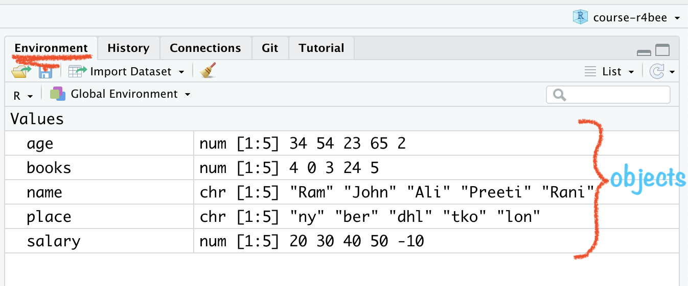

```{r packages, echo = FALSE, message=FALSE, warning=FALSE}
# Source
# source("xaringan-themer.R")

# load packages ----------------------------------------------------------------
library(tidyverse)
library(xaringanExtra)
library(xaringanthemer)
library(fontawesome)
library(here)
library(countdown)


options(htmltools.dir.version = FALSE)
knitr::opts_chunk$set(
  fig.width=9, fig.height=3.5, fig.retina=3,
  out.width = "80%",
  cache = TRUE,
  echo = FALSE,
  message = FALSE, 
  warning = FALSE,
  hiline = TRUE,
  fig.align='center'
)


# Link for the Figures
URL = c('https://raw.githubusercontent.com/fabbiocrux/Figures/main/')

#library(xaringanBuilder)
#build_pdf("index.Rmd")

# xaringanExtra
xaringanExtra::use_xaringan_extra(c("share_again",
                                    "panelset"))


xaringanExtra::use_extra_styles(hover_code_line = TRUE, mute_unhighlighted_code = TRUE)
```


# Modules:

1. .bg-yellow[[Basics of R & RStudio](#module1)]

  - R as Calculator
  - Functions
  - Objects

1. [Data Visualisation using ggplot2](#module2)

1. [Data Wrangling using dplyr](#module4)


---


class: inverse, center, middle
background-size: 50%
background-position: 50% 5%

# .bottom.big-text[R as a calculator]


---


## R as a calculator

.pull-left[

### .center[What you code]

```{r calci1, eval=FALSE, echo=TRUE}
1 #<<
```

]

.pull-right[

### .center[What you see]

```{r ref.label="calci1", echo=FALSE}

```
]
---


## R as a calculator

.pull-left[

### .center[What you code]

```{r calci2, eval=FALSE, echo=TRUE}
1
1 + 1 #<<
```

]

.pull-right[

### .center[What you see]

```{r ref.label="calci2", echo=FALSE}
```

]


---

## R as a calculator

.pull-left[

### .center[What you code]

```{r calci3, eval=FALSE, echo=TRUE}
1
1 + 1
34 / 40 #<<
```

]

.pull-right[

### .center[What you see]

```{r ref.label="calci3", echo=FALSE}
```

]

---

## R as a calculator

.pull-left[

### .center[What you code]

```{r calci4, eval=FALSE, echo=TRUE}
1
1 + 1
34 / 40
5 < 4 #<<
```

]

.pull-right[

### .center[What you see]

```{r ref.label="calci4", echo=FALSE}
```

]

---

## R as a calculator

.pull-left[

### .center[What you code]

```{r calci5, eval=FALSE, echo=TRUE}
1
1 + 1
34 / 40
5 < 4
16 == 16 #<<
```

]

.pull-right[
### .center[What you see]
```{r ref.label="calci5", echo=FALSE}
```
]

---

class: inverse, center, middle
background-size: 50%
background-position: 50% 5%

# .bottom.big-text[Functions]

---


## R Function

- "A function, in a programming environment, is a set of instructions. A programmer builds a function to avoid repeating the same task, or reduce complexity."

<br>

--

.panelset[

  .panel[.panel-name[Code]

```{r func1, eval=FALSE, echo=TRUE}
round(9.1565, 2) #<<
```

]
  .panel[.panel-name[Output]

```{r ref.label="func1", echo=FALSE}
```

]
]


---

class: center
background-image: url("figures/function-args.png")
background-size: 90%
background-position: 60% 70%

## Structure of R function


---

## .center[Round Function]

.panelset[

  .panel[.panel-name[Code]

```{r func2, eval=FALSE, echo=TRUE}
round(x = 564.56743, digits = 1)
```

]
  .panel[.panel-name[Output]

```{r ref.label="func2", echo=FALSE}
```

]
]

---

## .center[Round Function]

.panelset[

  .panel[.panel-name[Code]

```{r func3, eval=FALSE, echo=TRUE}
round(x = 564.56743, digits = 3)
```

]

  .panel[.panel-name[Output]

```{r ref.label="func3", echo=FALSE}
```

]
]


---

## .center[Square Root Function]

.panelset[

  .panel[.panel-name[Code]

```{r sqrt, eval=FALSE, echo=TRUE}
sqrt(x = 9) #<<
```

]

  .panel[.panel-name[Output]

```{r ref.label="sqrt", echo=FALSE}
```

]
]


---

## .center[Sequence Function]

.panelset[

  .panel[.panel-name[Code]

```{r seq, eval=FALSE, echo=TRUE}
seq.int(from = 10, to = 30, by = 5) #<<
```

]

  .panel[.panel-name[Output]

```{r ref.label="seq", echo=FALSE}
```

]
]


---


class: inverse, center, middle
background-size: 50%
background-position: 50% 5%

# .bottom.big-text[Scripts]

---


## R Comment:

- "Humans will be able to read the comments, but your computer will pass over them."<sup>1</sup>

- In R, `#` is used as a commenting symbol

.footnote[
[Source](https://en.wikipedia.org/wiki/Comment_(computer_programming)
]


---


---

## .center[How to add comment?]

.panelset[

  .panel[.panel-name[Code]

```{r comment, eval=FALSE, echo=TRUE}
# secret code of happiness

(1 + 4) - (3 * 5) / 10

## r does not evaluate this
# all these are comments
# comments are very important
```

]

  .panel[.panel-name[Output]

```{r ref.label="comment", echo=FALSE}
```

  ]

]


---


---

class: hide-count, hide-logo

background-image: url("https://pbs.twimg.com/media/FJJ3qyAXwAQSI8s?format=jpg&name=medium")
background-size: 70%
background-position: 70%

.footnote[
[Source](https://www.business-science.io/learning-r/2018/11/04/data-science-r-cheatsheet.html)
]


---

---

class: inverse, center, middle, hide-logo
background-image: url("")
background-size: contain
background-position: 5%

# big-text[Objects]

---

## R Object

##- "Just a name that you can use to call stored data"


.footnote[
Source: [RStudio](https://rstudio-education.github.io/hopr/basics.html)
]

---

## .center[Create Object: **Numeric**]

.panelset[

.panel[.panel-name[Code]
```{r obj1, eval=FALSE, echo=TRUE}
salary <- c(20, 30, 40, 50, -10) #<<
salary #<<
```

]

.panel[.panel-name[Output]

```{r ref.label="obj1", echo=FALSE}
```
]

]

---


## .center[Create Object: **Text**]

.panelset[

.panel[.panel-name[Code]

```{r obj2, eval=FALSE, echo=TRUE}
name <- c("Ram", "Rani", "Ali", "Preeti", "John")
name
```

]

.panel[.panel-name[Output]

```{r ref.label="obj2", echo=FALSE}
```
]

]


---

## .center[Create Object]

.panelset[

  .panel[.panel-name[Code]

```{r obj4, eval=FALSE, echo=TRUE}
age <- c(34, 54, 23, 65, 2 )
age
```

  ]

  .panel[.panel-name[Output]

```{r ref.label="obj4", echo=FALSE}
```

  ]

]


---

# .center[Create Object]

.panelset[

  .panel[.panel-name[Code]

```{r obj5, eval=FALSE, echo=TRUE}
place <- c("ny", "ber", "dhl", "tko", "lon")
place
```
  ]

  .panel[.panel-name[Output]
```{r ref.label="obj5", echo=FALSE}
```

  ]

]


---

# .center[Create Object]

.panelset[

  .panel[.panel-name[Code]
```{r obj6, eval=FALSE, echo=TRUE}
books <- c(4, 0, 3, 24, 5)
books
```


  ]

  .panel[.panel-name[Output]
```{r ref.label="obj6", echo=FALSE}
```

  ]

]

---

class: center

## RStudio Environment Window

```{r echo=FALSE, out.width="70%"}

```

--

## `r emo::ji("thinking")`.i.green[how to combine these<br> objects/variables into a data or say **tidy data**]


---


---

# Guidelines to name `objects` in R:

  - a name cannot start with a number

  - a name cannot use some special symbols, like ^, !, $, @, +, -, /, or *:

  - avoid caps

  - avoid space

  - use dash (like na-me) or underscore (like na_me)

  - if chronology matters then add date (2020-09-05-file-name)


---

class: hide-count
background-image: url("figures/tidydata_1_1.jpg")
background-size: contain

---

class: hide-count
background-image: url("figures/tidydata_1_2.jpg")
background-size: contain

---


```{r echo=FALSE, out.width="100%"}
knitr::include_graphics("figures/tidy-1.png")
```

.footnote[
[Source: https://r4ds.had.co.nz/index.html](https://r4ds.had.co.nz/index.html)
]

---

# .center[How to create a data object?]

.panelset[

  .panel[.panel-name[Code]
```{r df1, eval=FALSE, echo=TRUE}
social <- data.frame(age, books, name, place, salary) #<<

social

```

    ]

  .panel[.panel-name[Output 👇]

```{r ref.label="df1", echo=FALSE}
```

Tidy data
  ]
]

---

## .center[How to export data as a csv file?]

.panelset[

  .panel[.panel-name[Code]
```{r exp, eval=FALSE, echo=TRUE}
library(readr)
# to save this data set as a csv file
write_csv(social, "social.csv") #<<
```

    ]

  .panel[.panel-name[Output]
```{r ref.label="exp", echo=FALSE}
```

  ]
]


---

## .center[How to **Import** data as a csv file?]

.panelset[

  .panel[.panel-name[Code]
```{r imp, eval=FALSE, echo=TRUE}
library(readr)
# to save this data set as a csv file
import <- read_csv("social.csv") #<<
```

    ]

  .panel[.panel-name[Output]
```{r ref.label="imp", echo=FALSE}
```

  ]
]

---

class: your-turn, hide-count, hide-logo

# `r emo::ji("brain")` YOUR TURN

## .yellow[Write codes for below dataframe]

.panelset[

.panel[.panel-name[Task]
```{r echo=FALSE}
state <- c("Germany", "France", "India", "Russia", "USA", "New Zealand")
pop <- c(20, 19, 50, 25, 30, 5)
capital <- c("Berlin", "Paris", "Delhi", "Moscow", "Washington", "Wellington")
foundation <- c("1870-12-10", "1789-07-14", "1947-08-15", "1990-06-12", "1776-07-04", "1840-02-06")
world <- data.frame(state, pop, capital, foundation)
world
```

]

.panel[.panel-name[Answer]
```{r echo=T, eval=FALSE}
state <- c("Germany", "France", "India", "Russia", "USA", "New Zealand")
pop <- c(20, 19, 50, 25, 30, 5)
capital <- c("Berlin", "Paris", "Delhi", "Moscow", "Washington", "Wellington")
foundation <- c("1870-12-10", "1789-07-14", "1947-08-15", "1990-06-12", "1776-07-04", "1840-02-06")
world <- data.frame(state, pop, capital, foundation)
world
```

]

]
```{r echo=FALSE}
countdown(minutes = 10, top = 0, font_size = "3em")
```


---


class: center middle hide-count

#  `r emo::ji("woman_raising_hand_medium_skin_tone")``r emo::ji("man_raising_hand")`<br>.big-text[Q&A]


