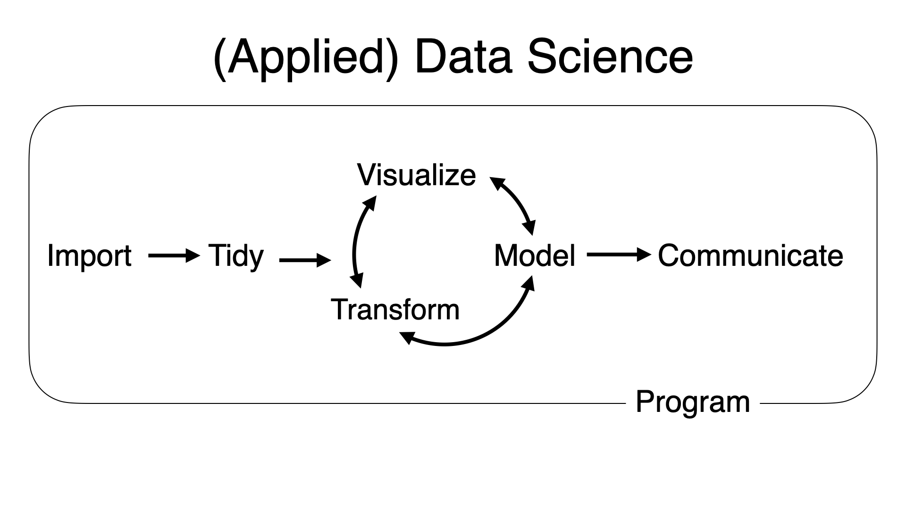
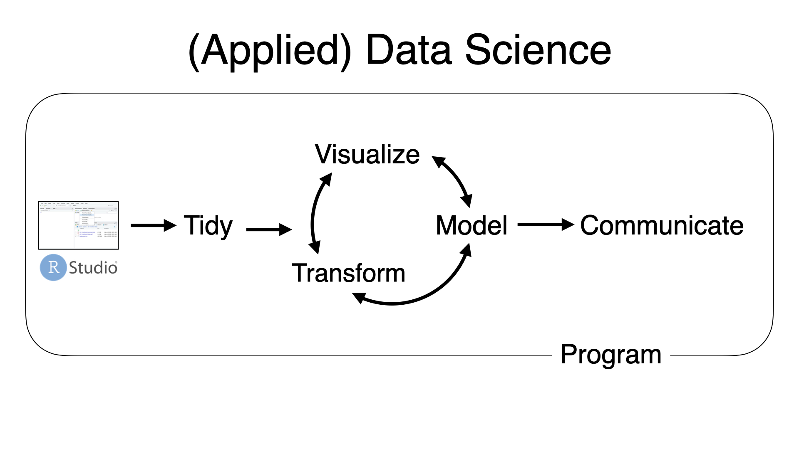
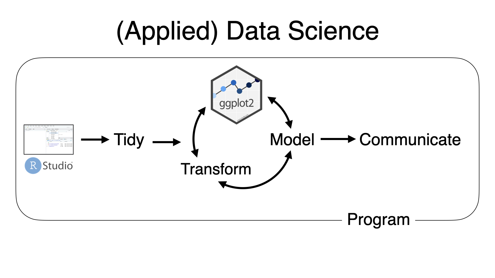

```{r packages, echo = FALSE, message=FALSE, warning=FALSE}
# Source
# source("xaringan-themer.R")

# load packages ----------------------------------------------------------------
library(tidyverse)
library(xaringanExtra)
library(xaringanthemer)
library(fontawesome)
library(here)
library(countdown)


options(htmltools.dir.version = FALSE)
knitr::opts_chunk$set(
  fig.width=9, fig.height=3.5, fig.retina=3,
  out.width = "80%",
  cache = TRUE,
  echo = FALSE,
  message = FALSE, 
  warning = FALSE,
  hiline = TRUE,
  fig.align='center'
)


# Link for the Figures
URL = c('https://raw.githubusercontent.com/fabbiocrux/Figures/main/')

#library(xaringanBuilder)
#build_pdf("index.Rmd")

# xaringanExtra
xaringanExtra::use_xaringan_extra(c("share_again",
                                    "panelset"))


xaringanExtra::use_extra_styles(hover_code_line = TRUE, mute_unhighlighted_code = TRUE)
```


# Modules:

1. .bg-yellow[[Basics of R & RStudio](#module1)]

1. [Data Visualisation using ggplot2](#module2)

  - `ggplot()`
  - `aes()`
  - `geom_<XY>()`
  
1. [Data Wrangling using dplyr](#module4)

---


# ggplot2 by [Hadley Wickham](http://hadley.nz/)
<br>
- "is a system for declaratively creating graphics, based on [The Grammar of Graphics](https://www.springer.com/gp/book/9780387245447)" (book by Late Leland Wilkinson)

.pull-left[
```{r wilkinson, echo=FALSE, out.width="40%", fig.cap="Late Leland Wilkinson"}
knitr::include_graphics("https://upload.wikimedia.org/wikipedia/en/b/b5/Leland_Wilkinson.png")
```
]

.pull-right[
```{r hadley, echo=FALSE, out.width="58%", fig.cap="Hadley Wickham"}
knitr::include_graphics("figures/hadley.jpg")
```
]

.footnote[
[Source](https://ggplot2.tidyverse.org/)
]


---

```{r, out.width = '100%', fig.align="center"}

```

---

```{r, out.width = '100%', fig.align="center"}

```

---


```{r, out.width = '100%', fig.align="center"}

```

---


class: inverse, center, middle
background-size: 50%
background-position: 50% 5%

# .bottom.big-text[Import data]


---


## Step 1: Load the packages

.pull-left[

### .center[What you code]

```{r load, eval=FALSE, echo=TRUE}
library(tidyverse)
library(readxl) 
```

]

.pull-right[

### .center[What you see]

```{r ref.label="load", echo=FALSE}

```
]


---

## Step 2: Read data from CSV

.panelset[

  .panel[.panel-name[Code]

```{r data, eval=FALSE, echo=TRUE}
attrakdiff <- read_csv(file = "Attrakdiff.csv") #<<
attrakdiff
```

]
  .panel[.panel-name[Output]

```{r ref.label="data", echo=TRUE}
```

]
]


---

# Variable types in R:


- `int` stands for integers, like 4, 55, 300.


- `dbl` stands for doubles, or real numbers like 3, 7.45, 1.565, 12.


- `chr` stands for character vectors, or strings like names.


- `dttm` stands for date-times (a date + a time).


- `lgl` stands for logical, vectors that contain only TRUE or FALSE.


- `fct` stands for factors, which R uses to represent **categorical variables** with fixed possible values like occupation: student, professional, government, business.


- `date` stands for dates.


---

class: hide-count, hide-logo

background-image: url("figures/layer7.png")
background-size: contain
background-position: 50% 50%

.footnote[
[Source](https://www.ericchowkokyew.com/data-visualization-with-ggplot2-in-r/)
]

---

class: left, middle, hide-count, hide-logo

background-image: url("figures/ggplot-logo.png")
background-size: contain
background-position: 100% 50%

# .big-text[R<br>Package]


---

# Key Components for ggplot2 Plot

1. data,

1. aesthetic mapping `aes()`

1. at least one layer of geom function `geom_XX()`


**Basic structure for graphics**

```{r, echo=TRUE, eval=FALSE}
ggplot(data = <DATA>) + 
  aes(x = <X>, y = <Y>) + 
   <GEOM_FUNCTION>() 
```


---

class: center, middle

# Graph 1: `geom_bar()`

---

###  Step 1:  Data

.panelset[

.panel[.panel-name[Task]

```{r layer11, echo=FALSE, out.width="45%"}
knitr::include_graphics("figures/layer1.png")
```

]

.panel[.panel-name[Codes]

```{r imp-data1, eval=FALSE, echo=TRUE , echo=TRUE}
ggplot(data = attrakdiff) #<<
```

]

.panel[.panel-name[Output]

```{r ref.label="imp-data1", echo=FALSE}
```

]
]


---

###  Step 2:  `aes`

.panelset[

.panel[.panel-name[Task]

```{r layer2, echo=FALSE, out.width="45%"}
knitr::include_graphics("figures/layer2.png")
```

]

.panel[.panel-name[Codes]

```{r aes, eval=FALSE, echo=TRUE}
ggplot(data = attrakdiff) +
  aes(x = Sex) #<<
```

]

.panel[.panel-name[Output]

```{r ref.label="aes", echo=FALSE}
```

]
]


---

###  Step 3:  graph `geom_bar`

.panelset[

.panel[.panel-name[Task]

```{r layer3, echo=FALSE, out.width="45%"}
knitr::include_graphics("figures/layer3.png")
```

]

.panel[.panel-name[Codes]

```{r geom-bar, eval=FALSE, echo=TRUE}
ggplot(data = attrakdiff) +
  aes(x = Sex) +
  geom_bar() #<<#<< 

```

]

.panel[.panel-name[Output]

```{r ref.label="geom-bar", echo=FALSE}
```

]
]

---

class: center, middle

# How to export plot to your computer?

---


.panelset[

.panel[.panel-name[Codes]

```{r export-plot, eval=FALSE, echo=TRUE}
ggplot(data = attrakdiff) +
  aes(x = Sex) +
  geom_bar()

ggsave("fig1.pdf")  # also try jpg/jpeg/png #<<
```

]

.panel[.panel-name[Output]

```{r ref.label="export-plot", echo=FALSE}

```

]
]


---

class: center, middle

# How to add color to bars?

---

.panelset[

.panel[.panel-name[Codes]

```{r color, eval=FALSE, echo=TRUE}
ggplot(data = attrakdiff) +
  aes(x = Sex) +
  geom_bar(fill = 'blue') #<<
```

]

.panel[.panel-name[Output]

```{r ref.label="color", echo=FALSE}

```

]
]


---

.panelset[

.panel[.panel-name[Codes]

```{r colors, eval=FALSE, echo=TRUE}
ggplot(data = attrakdiff) +
  aes(x = Sex) +
  geom_bar(fill = c("orange", "yellow")) #<<

# color names should be equal to the factor levels
```

]

.panel[.panel-name[Output]

```{r ref.label="colors", echo=FALSE}

```

]
]


---

class: center, middle

# How to add color using palette? `r emo::ji("art")`

---


## `r emo::ji("art")` Color Palette

- R package `RColorBrewer` & `wesanderson`

```{r fig.retina=3, fig.width=17, fig.height=15}
library(RColorBrewer)
display.brewer.all()
```


---


---

.panelset[

.panel[.panel-name[Codes]

```{r palette, eval=FALSE, echo=TRUE}
library(RColorBrewer)

ggplot(data = attrakdiff) +
  aes(x = Sex, fill = Age) +
  geom_bar() +
  scale_fill_brewer(palette = "Dark2") #<<

```

]

.panel[.panel-name[Output]

```{r ref.label="palette", echo=FALSE}

```

]
]


---


class: center, middle

# How to remove legend or change its position?

---


.panelset[

.panel[.panel-name[Codes]

```{r legend, eval=FALSE, echo=TRUE}

ggplot(data = attrakdiff) +
  aes(x = Sex, fill = Age) +
  geom_bar()+ 
  scale_fill_brewer(palette = "Dark2") +
  theme(legend.position = "none") #<< 
# top, bottom, left
```

]

.panel[.panel-name[Output]

```{r ref.label="legend", echo=FALSE}

```

]
]


---

class: center, middle

# How to plot title and axis titles?

---

.panelset[

.panel[.panel-name[Codes]

```{r labs, eval=FALSE, echo=TRUE}

ggplot(data = attrakdiff) +
  aes(x = Sex, fill = Age) +
  geom_bar() + 
  scale_fill_brewer(palette = "Dark2") +
  theme(legend.position = "none") +
  labs( #<< 
    title = "Participants", #<< 
    subtitle = "per Sex and Ages", #<< 
    x = "Sex", #<< 
    y = "Quantity" #<< 
  )

```

]

.panel[.panel-name[Output]

```{r ref.label="labs", echo=FALSE}

```

]
]


---


class: center, middle

# How to control size of text?

---

.panelset[

.panel[.panel-name[Codes]

```{r size, eval=FALSE, echo=TRUE}

ggplot(data = attrakdiff) +
  aes(x = Sex, fill = Age) +
  geom_bar() +
  scale_fill_brewer(palette = "Dark2") +
  theme(legend.position = "none",
        text = element_text(size = 20)) + #<<
  labs( 
    title = "Participants", 
    subtitle = "per Sex and Ages",
    x = "Sex", #<< 
    y = "Quantity" 
  )

```

]

.panel[.panel-name[Output]

```{r ref.label="size", echo=FALSE}

```

]
]


---

class: center, middle

# How to add themes to ggplot?

---

# ggplot2 themes 

<https://ggplot2.tidyverse.org/reference/ggtheme.html>

- theme_gray()
- theme_bw()
- theme_linedraw()
- theme_light()
- theme_dark()
- theme_minimal()
- theme_classic()
- theme_void()
- theme_test()

---


.panelset[

.panel[.panel-name[Codes]

```{r theme1, eval=FALSE, echo=TRUE}

ggplot(data = attrakdiff) +
  aes(x = Sex, fill = Age) +
  geom_bar() +
  scale_fill_brewer(palette = "Dark2") +
  theme(legend.position = "none",
        text = element_text(size = 20)) + 
  labs( 
    title = "Participants", 
    subtitle = "per Sex and Ages",
    x = "Sex", 
    y = "Quantity" 
  ) +
  theme_bw() #<<

```

]

.panel[.panel-name[Output]

```{r ref.label="theme1", echo=FALSE, warning=FALSE}

```

]
]

---


.panelset[

.panel[.panel-name[Codes]

```{r theme2, eval=FALSE, echo=TRUE}

ggplot(data = attrakdiff) +
  aes(x = Sex, fill = Age) +
  geom_bar() +
  scale_fill_brewer(palette = "Dark2") +
  theme(legend.position = "none",
        text = element_text(size = 20)) + 
  labs( 
    title = "Participants", 
    subtitle = "per Sex and Ages",
    x = "Sex", 
    y = "Quantity" 
  ) +
  theme_classic() #<<

```

]

.panel[.panel-name[Output]

```{r ref.label="theme2", echo=FALSE, warning=FALSE}

```

]
]


---


class: center, middle

# How to export plot to your computer?

---


.panelset[

.panel[.panel-name[Codes]

```{r export-plot2, eval=FALSE, echo=TRUE}

ggplot(data = attrakdiff) +
  aes(x = Sex, fill = Age) +
  geom_bar() +
  scale_fill_brewer(palette = "Dark2") +
  theme(legend.position = "none",
        text = element_text(size = 20)) + 
  labs( 
    title = "Participants", 
    subtitle = "per Sex and Ages",
    x = "Sex", 
    y = "Quantity" 
  ) +
  theme_classic() 

ggsave("fig2.jpg", width = 5, height = 5, dpi = "print")  #<<
```

]

.panel[.panel-name[Output]

```{r ref.label="export-plot2", echo=FALSE}

```

]
]

---


---

# More resources

- ggplot2 book https://ggplot2-book.org/

- CÉDRIC SCHERER https://www.cedricscherer.com/

- ggplot2 cook book http://www.cookbook-r.com/

- https://r-graph-gallery.com/

