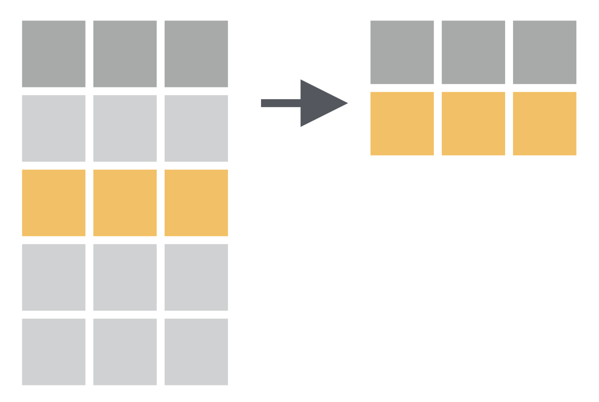
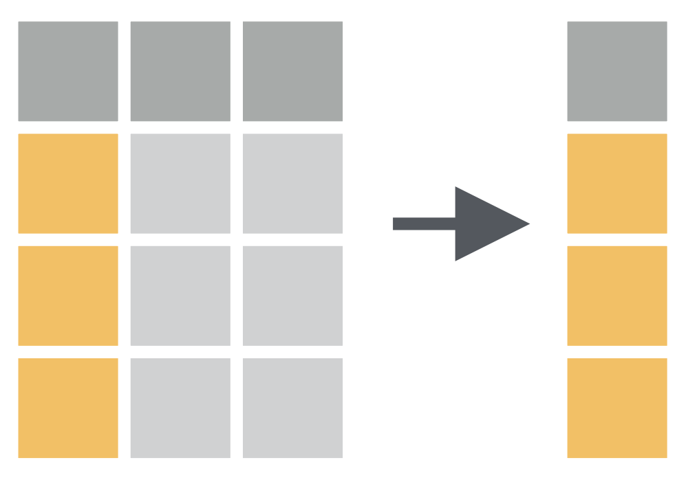
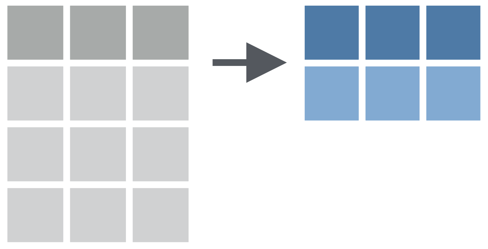

```{r packages, echo = FALSE, message=FALSE, warning=FALSE}
# Source
# source("xaringan-themer.R")

# load packages ----------------------------------------------------------------
library(tidyverse)
library(xaringanExtra)
library(xaringanthemer)
library(fontawesome)
library(here)
library(countdown)


options(htmltools.dir.version = FALSE)
knitr::opts_chunk$set(
  fig.width=9, fig.height=3.5, fig.retina=3,
  out.width = "80%",
  cache = FALSE,
  echo = FALSE,
  message = FALSE, 
  warning = FALSE,
  hiline = TRUE,
  fig.align='center'
)


# Link for the Figures
URL = c('https://raw.githubusercontent.com/fabbiocrux/Figures/main/')

#library(xaringanBuilder)
#build_pdf("index.Rmd")

# xaringanExtra
xaringanExtra::use_xaringan_extra(c("share_again",
                                    "panelset"))


xaringanExtra::use_extra_styles(hover_code_line = TRUE, mute_unhighlighted_code = TRUE)

library(kableExtra)

bs_style <- c("striped", "hover", "condensed", "responsive")

options(kable_styling_bootstrap_options = bs_style)

```


# Modules:

1. .bg-yellow[[Basics of R & RStudio](#module1)]

1. [Data Visualisation using ggplot2](#module2)

1. [Data Wrangling using dplyr](#module4)

  - `select()`
  - `filter()`
  - `mutate()`  
  - `group_by()`
  - `summarise()`
  - `left_join()`

---

class: center

# Course Progress

```{r echo=FALSE, out.width="100%"}
knitr::include_graphics("figures/data-science-wrangle.png")
```

---

# What is Data wrangling?
## (Manipulation des Données)

--

- "data exploration and data manipulation" [(Jesse Mostipak)](https://www.kaggle.com/jessemostipak/dive-into-dplyr-tutorial-1)

--

- "tidying and transforming" [(Hadley & Garrett)](https://r4ds.had.co.nz/index.html)

--

```{r echo=FALSE, out.width="100%"}
knitr::include_graphics("figures/tidy-1.png")
```


---

# "Transforming" data means:

- "Narrowing in on observations of interest ... 

--

- Creating new variables that are functions of existing variables ... and

--

- Calculating a set of summary statistics." 

.footnote[[Source: https://r4ds.had.co.nz/index.html](https://r4ds.had.co.nz/index.html)]

---

class: hide-count, middle, hide-logo
background-image: url(figures/dplyr.svg)
background-size: contain
background-position: right

# .big-text[R<br>Package]

---


# `dplyr` package

- "dplyr is a grammar of data manipulation"

--

- "providing a consistent set of verbs that help you solve the most common data manipulation challenges:"

--

- Few important functions:
 
  - `filter()` : picks cases based on their values.
  - `mutate()` : adds new variables that are functions of existing variables.
  - `select()` : picks variables based on their names
  - `arrange()` : changes the ordering of the rows.
  - `summarise()`: reduces multiple values down to a single summary.

.footnote[
[Source: https://dplyr.tidyverse.org/](https://dplyr.tidyverse.org/)
]


---

## Step 1: Load the packages

.pull-left[

### .center[What you code]

```{r load, eval=FALSE, echo=TRUE}
# Load packages
library(tidyverse)
library(kableExtra) 
```

]

---


## Step 2: Read data from CSV

.panelset[

  .panel[.panel-name[Code]

```{r data, eval=FALSE, echo=TRUE}
attrakdiff <- read_csv(file = "Attrakdiff.csv") #<<
attrakdiff
```

]
  .panel[.panel-name[Console]

```{r ref.label="data", echo=TRUE}
```

]

  .panel[.panel-name[Environnment]

```{r,  echo=F}
attrakdiff %>% 
  kable() %>% 
  kable_styling()
```

]
]


---


# `filter()` function: 

- Picks cases based on their values.

```{r filter-img, echo=FALSE, fig.align='center', out.width="65%"}

```


---

class: center, middle 

## How to have a data of only `Etudiant` Status?

---

.panelset[

.panel[.panel-name[Codes]

```{r filter-fun, eval=FALSE, echo=TRUE}

# There are two Status: Etudiant, Salarie
attrakdiff %>% 
  filter(Status == "Etudiant")  #<< 
```
]

.panel[.panel-name[Output]

```{r ref.label="filter-fun", echo=FALSE, message=FALSE}

```

]
]

---


class: center, middle

## How to export data file to your computer?

---


.panelset[

.panel[.panel-name[Codes]

```{r filter-fun1, eval=FALSE, echo=TRUE}
# There are two Status: Etudiant, Salarie
attrakdiff %>% 
  filter(Status == "Etudiant") %>%   #<< 
  write_csv("Etudiants.csv") #<<

```
]

.panel[.panel-name[Output]

```{r ref.label="filter-fun1", echo=FALSE, message=FALSE}

```

]

.panel[.panel-name[Environment]

```{r, echo=FALSE, message=FALSE}
attrakdiff %>% 
  filter(Status == "Etudiant") %>%   #<< 
  kable() 
  
```

]
]

---

# `r emo::ji("raised_hand")` WAIT! What is `%>% ` ?

--

- this is called **pipe** ( `%>%` = Control/Cmd + shift + m)

--

- "a powerful tool for clearly expressing a sequence of **multiple operations**"

--

- interpret/read it as **then**.

```{r echo=T, eval=TRUE}
attrakdiff %>% 
  filter(Status == "Etudiant") %>% 
  summary()
```


---

# Comparison: Relational Operators
### `filter( ... )`

`x == y` (equal)

--

`x < y`

--

`x > y`

--

`x <= y`

--

`x >= y`

--


`x != y` (not equal)


---

class: center, middle 

## How to have a data of `Note_1` more than 10?

---

.panelset[

.panel[.panel-name[Code]

```{r filter-fun2, eval=FALSE, echo=TRUE}
attrakdiff %>% 
  filter(Note_1 > 10)  #<< 
```
]

.panel[.panel-name[Console]

```{r ref.label="filter-fun2", echo=FALSE, message=FALSE}

```

]
]

---

class: center, middle 

## How to have a data of `Femme` with a `Note_1` more than 10?

---
.panelset[

.panel[.panel-name[Codes]

```{r filter-fun3, eval=FALSE, echo=TRUE}
attrakdiff %>% 
  filter(Note_1 > 10,
         Sex == "Femme")  #<< 
```
]

.panel[.panel-name[Output]

```{r ref.label="filter-fun3", echo=FALSE, message=FALSE}

```

]
]

---

class: center, middle 

## How to exclude data of people `Entre 18-25 ans` and `Note_2` less than than 90?

---

.panelset[

.panel[.panel-name[Codes]

```{r filter-fun4, eval=FALSE, echo=TRUE}
attrakdiff %>% 
  filter(Range != "Entre 18-25 ans", #<<
         Note_2 > 90) #<<
```
]

.panel[.panel-name[Console]

```{r ref.label="filter-fun4", echo=FALSE, message=FALSE}

```

]

.panel[.panel-name[Environment]

```{r  echo=FALSE, message=FALSE}
attrakdiff %>% 
  filter(Range != "Entre 18-25 ans",
         Note_2 > 90) %>% 
  kable()
```

]
]


---
class: center, middle

## How to have only top or bottom rows from data?

---

.panelset[

.panel[.panel-name[Codes]

```{r filter-fun41, eval=FALSE, echo=TRUE}
attrakdiff %>% 
  filter(Range != "Entre 18-25 ans",
         Note_2 > 90) %>% 
  head() #<<
```
]

.panel[.panel-name[Console]

```{r ref.label="filter-fun41", echo=FALSE, message=FALSE}

```

]
]

---

.panelset[

.panel[.panel-name[Codes]

```{r filter-fun42, eval=FALSE, echo=TRUE}
attrakdiff %>% 
  filter(Range != "Entre 18-25 ans",
         Note_2 > 90) %>% 
  tail(3) #<<
```
]

.panel[.panel-name[Console]

```{r ref.label="filter-fun42", echo=FALSE, message=FALSE}

```

]
]


---

# `select()` function: Chooses rows based on column values.

```{r select-img, echo=FALSE, fig.align='center', out.width="60%"}

```

---
class: center, middle

## How to have only `Sex` variable in data?

---

.panelset[

.panel[.panel-name[Codes]

```{r col-fun1, eval=FALSE, echo=TRUE}
attrakdiff %>% 
  select(Sex) #<<
```
]

.panel[.panel-name[Output]

```{r ref.label="col-fun1", echo=FALSE, message=FALSE}

```

]
]

---
class: center, middle

## How to have a specific range of variables in data?

---

.panelset[

.panel[.panel-name[Codes]

```{r col-fun2, eval=FALSE, echo=TRUE}
attrakdiff %>% 
  select(Group : Note_2)
```
]

.panel[.panel-name[Output]

```{r ref.label="col-fun2", echo=FALSE, message=FALSE}

```

]
]

---
class: center, middle

## How to have variables based upon their location in data?

---

.panelset[

.panel[.panel-name[Codes]

```{r col-fun3, eval=FALSE, echo=TRUE}
attrakdiff %>% 
  select(3 : 5)
```
]

.panel[.panel-name[Output]

```{r ref.label="col-fun3", echo=FALSE, message=FALSE}

```

]
]

---
class: center, middle

## How to have specific variables (*columns*) in data?

---

.panelset[

.panel[.panel-name[Codes]

```{r col-fun4, eval=FALSE, echo=TRUE}
attrakdiff %>% 
  select(Group, App, Note_1)
```
]

.panel[.panel-name[Output]

```{r ref.label="col-fun4", echo=FALSE, message=FALSE}

```

]
]

---

.panelset[

.panel[.panel-name[Codes]

```{r col-fun5, eval=FALSE, echo=TRUE}
attrakdiff %>% 
  select(-c(App, Sex, Range))
```
]

.panel[.panel-name[Output]

```{r ref.label="col-fun5", echo=FALSE, message=FALSE}

```

]
]


---

# `mutate()` : Adds new variables that are functions of existing variables

```{r mutate-img, echo=FALSE, fig.align='center', out.width="75%"}
knitr::include_graphics("figures/04-mutate.png")
```


---

class: center, middle

## How to create a ratio value of `Note_1` / `Note_2`?

---

.panelset[

.panel[.panel-name[Codes]

```{r col-fun7, eval=FALSE, echo=TRUE}
attrakdiff %>% 
  mutate(note_ratio = Note_1 / Note_2) #<<
```
]

.panel[.panel-name[Output]

```{r ref.label="col-fun7", echo=FALSE, message=FALSE}

```

]
]

---

.panelset[

.panel[.panel-name[Codes]

```{r col-fun77, eval=FALSE, echo=TRUE}
attrakdiff %>% 
  select(Note_1 , Note_2) %>%
  mutate(note_ratio = Note_1 / Note_2) #<<
```
]

.panel[.panel-name[Output]

```{r ref.label="col-fun77", echo=FALSE, message=FALSE}

```

]
]

---

## How to create Text with to use for a message ?

---

.panelset[

.panel[.panel-name[Codes]

```{r col-fun8, eval=FALSE, echo=TRUE}
attrakdiff %>% 
  select(ID, Range) %>%
  mutate(Text = paste("Personne", Range, sep = " "))
```
]

.panel[.panel-name[Output]

```{r ref.label="col-fun8", echo=FALSE, message=FALSE}

```

]
]

---


# `arrange()` function: Changes the order of the rows.

```{r arrange-img, echo=FALSE, fig.align='center', out.width="65%"}
knitr::include_graphics("figures/02-arrange.png")
```

---

class: center, middle

## How to have data arranged by the ascending order of `Notes_1`?

---

.panelset[

.panel[.panel-name[Codes]

```{r arg-fun, eval=FALSE, echo=TRUE}
attrakdiff %>% 
  arrange(Note_1) #<<
```
]

.panel[.panel-name[Output]

```{r ref.label="arg-fun", echo=FALSE, message=FALSE}

```

]
]

---

.panelset[

.panel[.panel-name[Codes]

```{r arg-fun2, eval=FALSE, echo=TRUE}
attrakdiff %>% 
  arrange( desc(Note_1)) #<<
```
]

.panel[.panel-name[Output]

```{r ref.label="arg-fun2", echo=FALSE, message=FALSE}

```

]
]

---

.panelset[

.panel[.panel-name[Codes]

```{r arg-fun3, eval=FALSE, echo=TRUE}
attrakdiff %>% 
  arrange(Note_2)
```
]

.panel[.panel-name[Output]

```{r ref.label="arg-fun3", echo=FALSE, message=FALSE}

```

]
]

---


## `summarise()` function: Chooses rows based on column values.

```{r summ-img, echo=FALSE, fig.align='center', out.width="75%"}

```

---

class: center, middle

# How to find mean of `Note_1` for all participants?

---

.panelset[

.panel[.panel-name[Codes]

```{r summ-fun1, eval=FALSE, echo=TRUE}
attrakdiff %>% 
  summarise(Moyenne = mean(Note_1)) #<<
```
]

.panel[.panel-name[Output]

```{r ref.label="summ-fun1", echo=FALSE, message=FALSE}

```

]
]

---

class: center, middle

## How to find the mean `Note_1` per each `Sex`?

---

.panelset[

.panel[.panel-name[Codes]

```{r summ-fun2, eval=FALSE, echo=TRUE}
attrakdiff %>% 
  group_by(Sex) %>% #<<
  summarise(Moyenne = mean(Note_1))
```
]

.panel[.panel-name[Output]

```{r ref.label="summ-fun2", echo=FALSE, message=FALSE}

```

]
]

---

class: center, middle

## How to find the mean `Note_1` per each `Sex` and the number of participants?

---

.panelset[

.panel[.panel-name[Codes]

```{r summ-fun21, eval=FALSE, echo=TRUE}
attrakdiff %>% 
  group_by(Sex) %>% 
  summarise(Moyenne = mean(Note_1), 
             Quantity = n()) #<<

```
]

.panel[.panel-name[Output]

```{r ref.label="summ-fun21", echo=FALSE, message=FALSE}

```

]
]

---

class: center middle hide-count

#  `r emo::ji("woman_raising_hand_medium_skin_tone")``r emo::ji("man_raising_hand")`<br>.big-text[Q&A]

