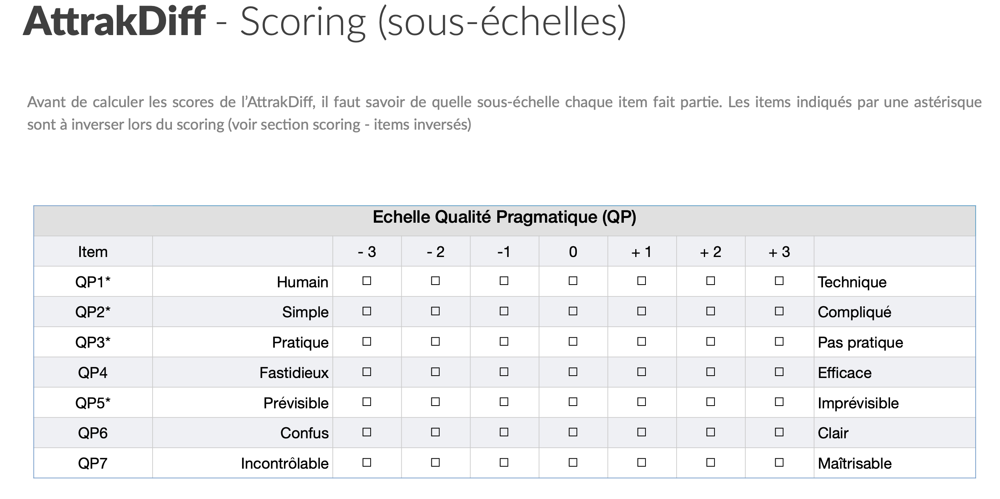

```{r packages, echo = FALSE, message=FALSE, warning=FALSE}
# Source
# source("xaringan-themer.R")

# load packages ----------------------------------------------------------------
library(tidyverse)
library(xaringanExtra)
library(xaringanthemer)
library(fontawesome)
library(here)
library(countdown)


options(htmltools.dir.version = FALSE)
knitr::opts_chunk$set(
  fig.width=9, fig.height=3.5, fig.retina=3,
  out.width = "80%",
  cache = FALSE,
  echo = FALSE,
  message = FALSE, 
  warning = FALSE,
  hiline = TRUE,
  fig.align='center'
)


# Link for the Figures
URL = c('https://raw.githubusercontent.com/fabbiocrux/Figures/main/')

#library(xaringanBuilder)
#build_pdf("index.Rmd")

# xaringanExtra
xaringanExtra::use_xaringan_extra(c("share_again",
                                    "panelset"))


xaringanExtra::use_extra_styles(hover_code_line = TRUE, mute_unhighlighted_code = TRUE)

library(kableExtra)

bs_style <- c("striped", "hover", "condensed", "responsive")

options(kable_styling_bootstrap_options = bs_style)

```


# Goal:

1. .bg-yellow[Make the AtrrakDiff Analysis]

   1. Reading the Excel/CSV Data
   1. Treating Excel/CSV Data
   1. Making the Tables and the Graphics
   1. Introduce the results in Rmarkdown table.

---


class: inverse middle center

#  Phase 1: Reading the Excel/CSV Data

---

## Step 1.1: Load the packages

.pull-left[

### .center[What you code]

```{r load, eval=FALSE, echo=TRUE}
# Load packages
library(tidyverse)
library(kableExtra) 
```

]

---

## Step 1.2: Read data from CSV

.panelset[
  .panel[.panel-name[Codes]
```{r data, eval=FALSE, echo=TRUE}
attrakdiff <- read_csv(file = "Attrakdiff.csv") #<<
attrakdiff
```
]
  .panel[.panel-name[Console]
```{r ref.label="data", echo=TRUE}
```
]

  .panel[.panel-name[Environnment]
```{r,  echo=F}
attrakdiff %>% 
  kable() %>% 
  kable_styling()
```
]
]


---


## Step 1.3: Filtering your Group and calculating the total of Participants

.panelset[
  .panel[.panel-name[Codes]
```{r step.3, echo=TRUE}
total <- 
  attrakdiff %>% filter(Group ==  "Test") %>% #<<
  nrow() #<<
```
]
  .panel[.panel-name[Console]
```{r , echo=TRUE}
total
```
]
]


---

class: inverse middle center

#  Phase 2: Manipulating CSV Data 

---


## Step 2.1: Change the Participants

.panelset[
  .panel[.panel-name[Codes]
```{r step.2.1, echo=TRUE, eval=FALSE}
step.2.1 <- 
  attrakdiff %>% 
  pivot_longer(cols = c(QP1 : ATT7), #<<
                         names_to = "Variables", #<<
                         values_to = "Answers") #<<
step.2.1
```
]


.panel[.panel-name[Output]

```{r , echo=FALSE}
step.2.1 %>% 
  #head(10) %>% 
  kable() %>% 
  kable_classic() 
```

]

]

---


## Step 2.2: Changing the range (1,7) to (-3,+3)

---

.panelset[

  .panel[.panel-name[Approche 1]
```{r step.2.2.1,  echo=TRUE}
step.2.2 <- #<<
  step.2.1 %>% #<<
  mutate( 
    change_scale = #<<
      case_when(
        Answers == 1  ~  -3, #<<
        Answers == 2  ~  -2,  #<<
        Answers == 3  ~  -1,  #<<
        Answers == 4  ~  0,  #<<
        Answers == 5  ~  1,  #<<
        Answers == 6  ~  2,  #<<
        Answers == 7  ~  3,  #<<
        TRUE ~ 99 #<< ## High number if a problem arrives
      )
  )
```
  ]


.panel[.panel-name[Output]

```{r ,echo=FALSE}
step.2.2 %>% 
  #head(10) %>% 
  kable() %>% 
  kable_classic() 
  
```

]

]


---

## Step 2.3: Inversing the answers of some items

.panelset[

  .panel[.panel-name[Literature]
  
[See Documentation](https://carinelallemand.files.wordpress.com/2015/09/version-franc3a7aise-attrakdiff_lallemand_2015.pdf)
   

```{r, out.width='100%'}

```
  
  ]
  
  
  .panel[.panel-name[Scales to change]

```{r,  echo=TRUE}
## Inversing the Scale
toInvert <- c("QP1", "QP2", "QP3", "QP5",
              "ATT1", "ATT3", "ATT5", "ATT7",
              "QHS1", "QHS3", "QHS4", "QHS7",
              "QHI2", "QHI3", "QHI6")

```

  ]

  
  .panel[.panel-name[Approche 1]
```{r step.2.3.1,  echo=TRUE}
step.2.3 <- #<<
  step.2.2 %>% #<<
  mutate( 
    final_value = #<<
      case_when(
        Variables == "QP1"  ~  change_scale*(-1), #<<
        # Variables == "QP2"  ~  change_scale*(-1), #<<
        # Variables == "QP3"  ~ change_scale*(-1), #<<
        # ... and all of variables to invert      #<<
        TRUE ~ change_scale #<<
      )
  )
```
  ]


  .panel[.panel-name[Approche 2]
```{r step.2.3.2,  echo=TRUE, eval=TRUE}
step.2.3 <- #<<
  step.2.2 %>%  #<<
  mutate( #<<
    final_value = #<<
      case_when( #<<
        Variables %in% toInvert ~ change_scale*(-1), #<<
        TRUE ~ change_scale #<<
      )
  )
```
  ]

.panel[.panel-name[Output]

```{r ,echo=FALSE}
step.2.3 %>% 
  kable() %>% 
  kable_classic()
```

]

]


---

## Step 2.4: Groups of the Dimmensions ----


.panelset[

  .panel[.panel-name[Approche 1]
```{r step.2.4.1,  echo=TRUE}
step.2.4 <- #<<
  step.2.3 %>% #<<
  mutate(
    factors = 
      case_when(
        str_detect(Variables, "QP") ~ "Qualité Pragmatique (QP)",
        str_detect(Variables, "QHS") ~ "Qualité Hédonique - Stimulation (QH-S)",
        str_detect(Variables, "QHI") ~ "Qualité Hédonique - Identité (QH-I)",
        str_detect(Variables, "ATT") ~ "Attractivité Globale (ATT)",
        TRUE ~ "ATTENTION"
      )
  )
```
  ]


.panel[.panel-name[Output]

```{r ,echo=FALSE}
step.2.4 %>% 
  #head(10) %>% 
  kable() %>% 
  kable_classic() 
  
```

]

]

---

class: inverse middle center

#  Phase 3: Graphics
## Graphics 2

---

.panelset[

  .panel[.panel-name[Table means]
  
```{r, echo=TRUE}
## Calculating the mean values and the error

Table_II <-
   step.2.4 %>%
   group_by( Variables ) %>%
   summarise( Moyenne = mean(final_value))

```

  ]
  
  .panel[.panel-name[Code Graphic]

```{r, echo=TRUE}

Graph_II <-
   Table_II %>%
   ggplot() +
   aes(x = Variables, y=Moyenne, group =1) +
   geom_line( color="grey" ) +
   geom_point() +
   scale_y_continuous(name="Moyenne", breaks=seq(-3,3,1), limits=c(-3, 3))+
   scale_x_discrete(name="Items",
                    labels=c("ATT1" = "Plaisant - Déplaisant",
                             "ATT2" = "Laid - Beau",
                             "ATT3" = "Agréable - Désagréable",
                             "ATT4" = "Rebutant - Attirant",
                             "ATT5" = "Bon - Mauvais",
                             "ATT6" = "Repoussant - Attrayant",
                             "ATT7" = "Motivant - Décourageant",
                             "QHI1" = "M'isole - Me socialise",
                             "QHI2" = "Professionel - Amateur",
                             "QHI3" = "De bon goût - De mauvais goût",
                             "QHI4" = "Bas de gamme - Haut de gamme",
                             "QHI5" = "M'exclut - M'intègre",
                             "QHI6" = "Me rapproche des autres - Me sépare des autres",
                             "QHI7" = "Non présenatble - Présentable",
                             "QHS1" = "Original - Conventionnel",
                             "QHS2" = "Sans imagination - Créatif" ,
                             "QHS3" = "Audacieux - Prudent",
                             "QHS4" ="Novateur - Conservateur",
                             "QHS5" = "Ennuyeux - Captivant",
                             "QHS6" = "Peu exigeant - Challeging",
                             "QHS7" = "Nouveau - Commun" ,
                             "QP1" = "Humain - Technique",
                             "QP2"= "Simple - Compliqué",
                             "QP3" = "Pratique - Pas pratique",
                             "QP4" = "Fastidieux - Efficace",
                             "QP5" = "Prévisible - Imprévisible",
                             "QP6" = "Confus - Clair",
                             "QP7" = "Incontrôlable - Maîtrisable"))+
   coord_flip() +
   annotate("rect", xmin=c(1,8,15,22), xmax=c(7,14,21,28),
            ymin=rep(-3,4), ymax=rep(3, 4),
            alpha = .1 , fill = c("blue", "red", "grey","green")) +
   ggplot2::annotate("text",
                     y = c(2, 2, 2, 2),
                     x = c(4, 11, 19, 26),
                     label = c("Attractivité \n globale",
                               "Qualité \n hédonique - identification",
                               "Qualité \n hédonique - stimulation",
                               "Qualité \n pragmatique"),
                     family = "Palatino", fontface = 3, size=3) +
   theme_minimal(base_size = 12, base_family = "Palatino") +
   labs(x = "",
        y = "Level ",
        title = "AtrakDiff Profile",
        subtitle = paste("Total of answers:" , total ) ) +
   theme(
      legend.position = "right",
      panel.border = element_blank(),
      panel.spacing = unit(0.1, "lines"),
      strip.text.x = element_text(size = 18, family = "Palatino")
   )

```
  ]
  
  .panel[.panel-name[Graphic]
```{r}
Graph_II
```
    
  ] 
  
 .panel[.panel-name[Exported graphics]
```{r, echo=TRUE}
ggsave(filename = "AttrakDiff-2.jpg", 
       plot = Graph_II,
       width = 5, height = 7, dpi="print") 
```
    
  ]   
]

---


class: inverse middle center

#  Phase 3: Graphics
## Graphics 3

---

.panelset[

  .panel[.panel-name[Table means]
  
```{r, echo=TRUE}
## Calculating 
QH <-
   step.2.4 %>%
   filter(factors == "Qualité Hédonique - Stimulation (QH-S)" |
             factors == "Qualité Hédonique - Identité (QH-I)") %>%
   summarise(QH = mean(final_value),
             QH_sd = sd(final_value),
             QH_IC_min = t.test(final_value)$conf.int[1], # see https://larmarange.github.io/analyse-R/intervalles-de-confiance.html
             QH_IC_max = t.test(final_value)$conf.int[2]
   )

QP <-
   step.2.4 %>%
   filter(factors == "Qualité Pragmatique (QP)") %>%
   summarise(QP = mean(final_value),
             QP_sd = sd(final_value),
             QP_IC_min = t.test(final_value)$conf.int[1], # see https://larmarange.github.io/analyse-R/intervalles-de-confiance.html
             QP_IC_max = t.test(final_value)$conf.int[2]
   )


Table_III <- data.frame(QH, QP)
names(Table_III)

```

  ]
  
  .panel[.panel-name[Code Graphic]

```{r, echo=TRUE}

Graph_III <-
   Table_III %>%
   ggplot() +
   aes(x=QP, y=QH) +
   geom_point() +
   ylim(-3,3)+ xlim(-3,3) +
   geom_hline(yintercept=c(-1,1))+
   geom_vline(xintercept=c(-1,1)) +
   annotate("rect", xmin = Table_III$QP_IC_min, xmax = Table_III$QP_IC_max,
            ymin = Table_III$QH_IC_min, ymax = Table_III$QH_IC_max,
            alpha = .5 , fill = c("blue")) +
   ggplot2::annotate("rect", xmin=c(-1), xmax=c(1),
                     ymin=c(-1), ymax=c(1),
                     alpha = .1 , fill = c("#009999")) +
   ggplot2::annotate("text",
                     y = c(0.5),
                     x = c(0),
                     label = c("Neutre"),
                     family = "Palatino", fontface = 3, size=4) +
   labs(title = "Global AttrakDiff ",
        subtitle = paste("Total of answers:" , total),
        x = "Qualité Pragmatique",
        y = "Qualité Hedonique ") +
   theme_minimal(base_size = 10, base_family = "Palatino")


```
  ]
  
  .panel[.panel-name[Graphic]
```{r}
Graph_III
```
    
  ] 
  
 .panel[.panel-name[Exported graphics]
```{r, echo=TRUE}
ggsave(filename = "AttrakDiff-3.jpg", 
       plot = Graph_III,
       width = 5, height = 7, dpi="print") 
```
    
  ]   
]

